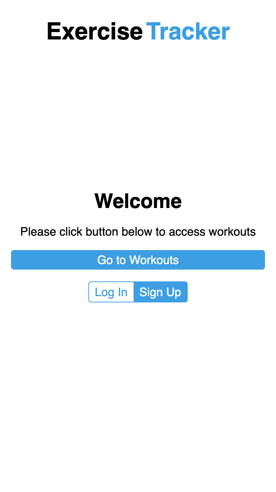
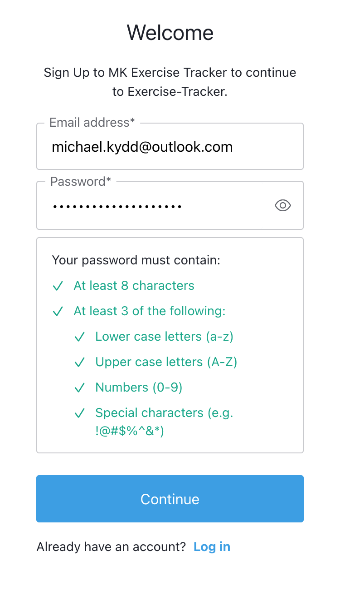
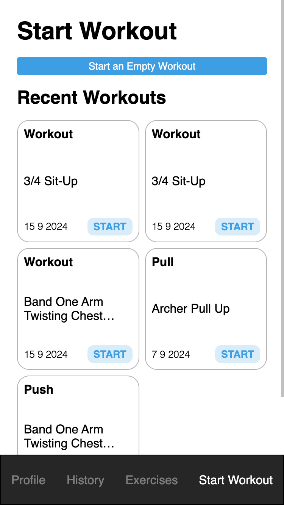
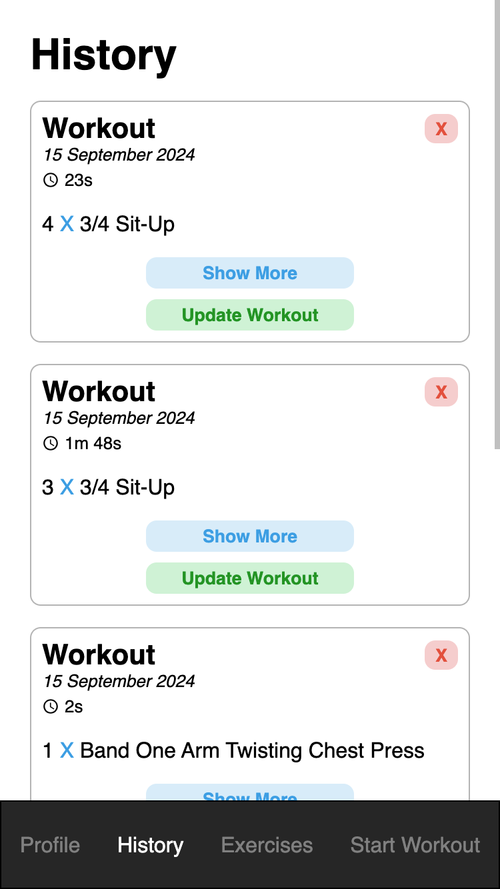
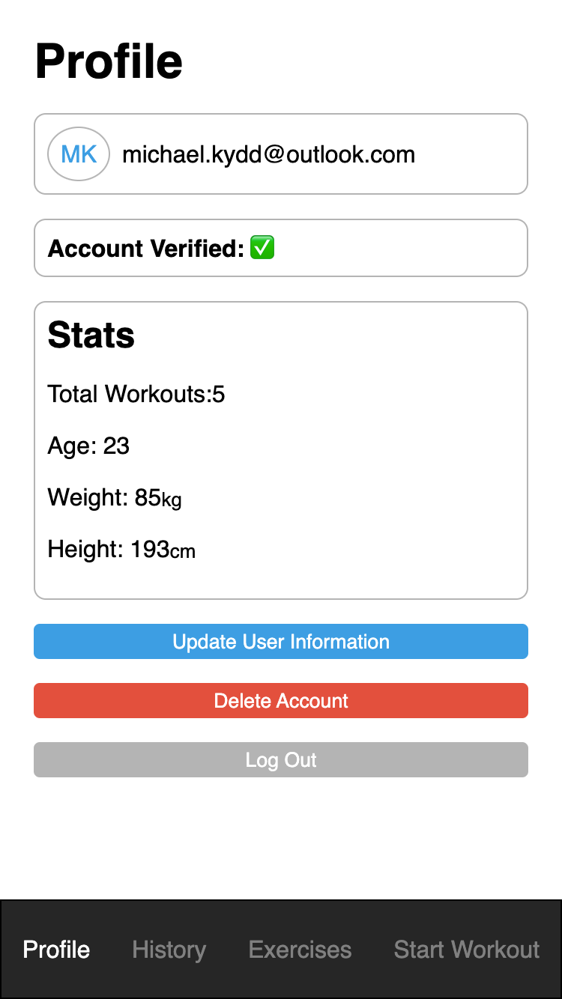
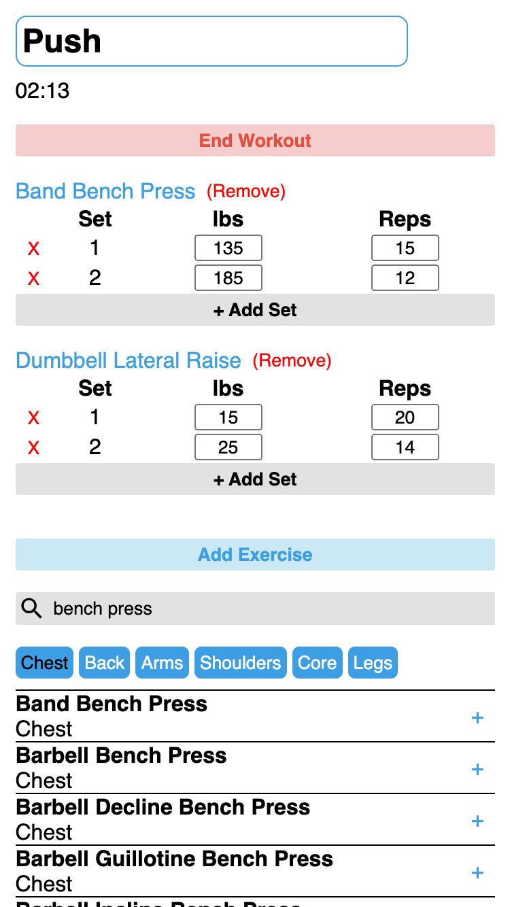

# Exercise Tracker

A web app that helps users track their workouts. Users can create an account, log their workouts, and view their workout history. The app is free to use.

## Features

- **User Accounts**: Sign up and log in to track your workouts.
- **Track Workouts**: Start a workout session and log various exercises.
- **History**: View past workouts and track your progress.
- **Profile**: Update your account details.
- **Responsive Design**: Works on both mobile and desktop devices.

## Screenshots

### Home Page

### Sign Up

### Start Workout

### Workout History

### Profile Page

### Workout in Progress

## Technologies Used

- Frontend: HTML, CSS, JavaScript, React
- Backend: Node.js, Express
- Database: MongoDB
- Authentication: AUTH0, JSON Web Tokens (JWT)

## Contributing

Feel free to submit issues or pull requests to help improve the app.